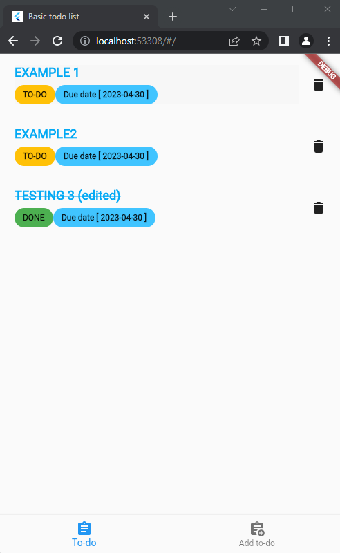

# flutter- todo-app

#### FEATURES:
* TODO'S CRUD
* BASIC REDUX SERVICE IMPL

#### Observations
* To refresh the list change the current tab
* The Check box has been removed from main page and edit/create page due to API capabilities
* Simple list and a "empty" message indicator if the list is empty

### To-do main page

### Create to-do page

### Edit to-do page
